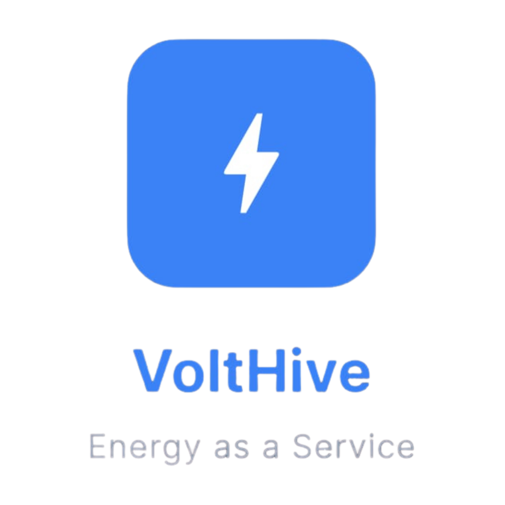

# VoltHive ⚡

<div align="center">
  
  
  **Production-Ready Energy-as-a-Service (EaaS) Digital Platform**
  
  https://volthive-84a79.web.app/ • https://youtu.be/sFyV116d2iA
</div>

---

## 📖 Overview
**VoltHive** is a highly scalable, premium Energy-as-a-Service (EaaS) digital platform. Built from a single Flutter codebase for Web, Android, and iOS, it provides a comprehensive ecosystem for managing smart energy subscriptions, analyzing real-time power consumption, monitoring battery health, and delivering a trustworthy user experience for households and enterprises alike.

## ✨ Key Features
- **Unified Clean Architecture:** Powered by Riverpod 2.5 for robust state management.
- **Firebase Backend Ecosystem:** Leverages Firebase Auth, Firestore, Cloud Functions (Node.js 20), FCM (Cloud Messaging), and Firebase Hosting.
- **AI Integration:** Smart recommendations and live chat support powered by Firebase AI Logic / Vertex AI.
- **Smart Meter IoT Integration:** Real-time data streams for solar generation (kWh), grid consumption (kWh), and battery level tracking.
- **Robust Payment System:** Stripe (metered & subscription billing) combined with Indian payment gateway integrations (Gpay, PhonePe, Paytm, BHIM).
- **Dynamic Carbon Impact Invoices:** Automatically generated PDF invoices featuring cryptographic gateway transaction proofs, personalized energy & carbon impact summaries, interactive QR codes, and precise next billing dates.
- **Premium UI/UX:** Responsive Material 3 design utilizing the "Plus Jakarta Sans" typography, an eco-conscious color palette, and full dark-mode support for OLED efficiency.

## 🔗 Quick Links
- 🎥 **[Watch Demo Video]((Insert Demo Video Link Here))**
- 🌍 **[Visit Live Product]((Insert Product Link Here))**

## 🏗️ High-Level Architecture
### Frontend
- **Framework:** Flutter (Web, Android, iOS)
- **State Management:** Riverpod 2.5 + AsyncValue
- **UI Toolkit:** Material 3 + Responsive Design (Mobile First)

### Backend (Firebase - Blaze Plan)
- **Authentication:** Email, Google, Phone Number
- **Database:** Firestore (users, subscriptions, plans, meter_readings, invoices, tickets, notifications)
- **Serverless:** Firebase Cloud Functions for Stripe webhooks and sensitive business logic
- **Infrastructure:** Firebase Hosting (Web App), Firebase Analytics, and Crashlytics

## 📦 Subscription Plans Overview
Flexible plans built for efficiency, paired with stackable add-ons. 
*(Note: 13% discount available on annual plans)*

| Plan | Solar Capacity | Battery | SLA | Best For |
|---|---|---|---|---|
| **Spark** | 3 kW | 6 kWh | 99.5% | Small homes, clinics, tiny cafes |
| **Bloom** | 6 kW | 10 kWh | 99.7% | Medium homes, boutiques |
| **Thrive**| 10 kW | 15 kWh | 99.8% | Large villas, medium hotels |
| **Surge** | 15 kW | 25 kWh | 99.9% | Resorts, sports complexes |
| **Forge** | 25 kW | 40 kWh | 99.95% | Large hotels, factories, colleges |
| **Apex**  | 50 kW+ | 80 kWh+ | 99.99% | Data centers, industrial parks |

**Stackable Add-ons:**
- Extra 5 kWh battery
- EV charging (2 ports)
- AI load optimizer + predictive alerts
- Priority 24×7 support (recommended from Surge+)

## 🎨 UI & Design Language
- **Typography:** `Plus Jakarta Sans` for clean, professional data representation.
- **Color Palette:**
  - 🟢 **Primary:** `#10B981` (Emerald Green - Eco, Success, Charge)
  - 🟡 **Solar Yield:** `#F59E0B` (Warm Amber - Sun energy)
  - ⚪ **Grid / Consumption:** `#64748B` (Cool Neutral Gray)
  - 🔴 **Warning:** `#EF4444` (Soft Red)
  - 🌑 **Dark Mode:** Deep slate `#0F172A` / `#020617`

## 🚀 Getting Started

### Prerequisites
- [Flutter SDK](https://flutter.dev/docs/get-started/install) (Stable Channel)
- Node.js (v20+ for Firebase Functions)
- [Firebase CLI](https://firebase.google.com/docs/cli) (`npm install -g firebase-tools`)

### Installation & Run
1. **Clone the repository:**
   ```bash
   git clone <repository_url>
   cd volthive
   ```
2. **Install Flutter dependencies:**
   ```bash
   cd volthive
   flutter pub get
   ```
3. **Run the application:**
   ```bash
   # Run for Web
   flutter run -d chrome
   
   # Run for Android
   flutter run -d android
   ```

### Deployment Configuration
- Configure `.firebaserc` and `firebase.json` for your specific Firebase environment.
- Run `flutter build web` or `flutter build appbundle` for production deployment targeting Firebase Hosting or the Google Play Store respectively.

## 🛡️ License
Proprietary software. All rights reserved. Do not distribute without permission.
